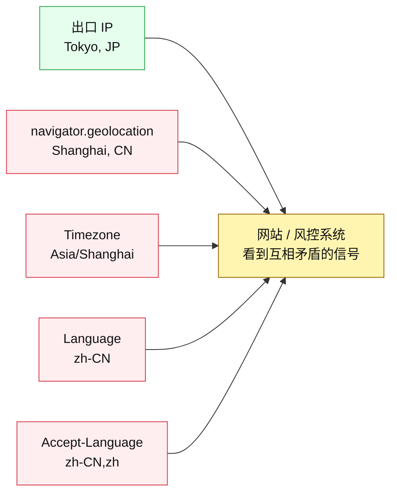
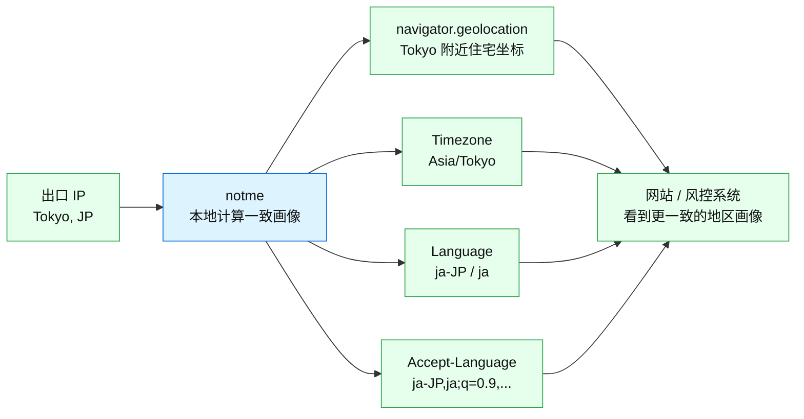
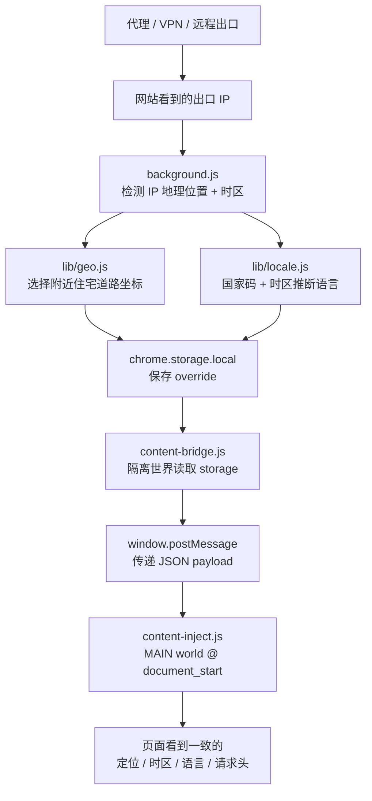

# notme

> 让浏览器画像与当前出口 IP 保持一致：地理位置、时区、语言、`Accept-Language` —— 全自动、覆盖每个普通网页。

notme 是一个 Chrome Manifest V3 扩展，适合使用代理、VPN、远程桌面、跨区出口节点的人。它解决的问题不是“换 IP”，而是“换了 IP 之后，浏览器仍然暴露出另一个地区的环境”。

[English](./README.md) · [隐私政策](./PRIVACY.md) · [技术说明](./docs/TECHNICAL.md)

---

## Motivation：只换 IP 远远不够

最近 Claude / Anthropic 的封号风波让很多人意识到一个现实问题：平台的风控如果机械地依赖地址、地区、登录环境等信号，就可能非常粗暴。很多用户反馈过，只是换了 IP、旅行、使用 VPN、或者浏览器环境和 IP 地区不一致，就可能触发账号限制甚至封禁。

Anthropic（Claude 的母公司）把这类粗糙的位置/地址启发式信号变成账号损失风险，这种做法当然令人愤怒。但愤怒解决不了实际问题。我们能做的是把自己的浏览器环境整理得更一致，减少无谓的风险信号。

最常见的问题是：多数人只换了 **IP 地址**，但没有同步更换浏览器暴露出来的其他信息。

- `navigator.geolocation` 仍然可能暴露真实物理位置。
- `Date.prototype.getTimezoneOffset()` 仍然暴露本机时区。
- `Intl.DateTimeFormat().resolvedOptions().timeZone` 仍然暴露系统时区。
- `navigator.language` / `navigator.languages` 仍然暴露本机语言。
- HTTP `Accept-Language` 请求头仍然暴露另一个语言环境。

这些信号一旦互相矛盾，就会形成非常典型的“代理/VPN/异常环境”画像。notme 的目标就是把这条链补齐。

## 使用前后有什么变化

### 使用前：只换 IP，浏览器画像仍然分裂



### 使用后：浏览器画像跟随出口 IP



### 覆盖了哪些信号

| 信号 | 使用前常见状态 | 使用 notme 后 |
| --- | --- | --- |
| 出口 IP | 代理/VPN 节点地区 | 不改变 IP，只读取当前出口 IP |
| HTML5 定位 | 真实设备位置或系统位置 | 出口 IP 附近住宅感坐标，返回真正的 `GeolocationPosition` |
| 定位权限 | 可能显示未授权/真实状态 | 返回真正的 `PermissionStatus`，state 为 `granted` |
| **整个 `Date` 本地时间面** | 只有 `getTimezoneOffset` 被改，`getHours`/`toString`/`toLocaleString` 等仍暴露本机时区 | `getTimezoneOffset` **以及** 所有本地 getter/setter、`toString`/`toDateString`/`toTimeString`、`toLocale*`、数字构造函数、无偏移量字符串解析、`Date()` 函数调用，全部按出口 IP 时区（含 DST）计算 |
| Intl 时区 | 本机系统时区 | 出口 IP 对应时区（即使传入 locale 也注入） |
| navigator 语言 | 本机语言 | 根据国家码 + 时区推断 |
| Intl 默认 locale | 本机 locale | `DateTimeFormat`/`NumberFormat`/`Collator`/`RelativeTimeFormat`/`PluralRules`/`ListFormat`/`DisplayNames`/`Segmenter`/`DurationFormat` + `Number`/`Array`/`BigInt.toLocaleString` 全部一致 |
| Accept-Language | 本机请求头语言，且仅主/子框架和 XHR 生效 | 与推断语言一致，覆盖**所有**资源类型（图片/字体/脚本/beacon 等） |
| WebRTC IP | 可能绕过代理泄露真实 IP | 可选强制走代理（`disable_non_proxied_udp`），ICE candidate 不再泄露真实 IP |
| 反检测 | `Function.prototype.toString` 可拆穿伪装，`data-notme` 属性残留在 DOM | 伪装函数对 `fn.toString()` 与 `Function.prototype.toString.call(fn)` 都显示 native；payload 改用 `window.postMessage` 传递，不写入 DOM；捕获后立即删除 `window.GeoMirrorTZ` 全局,页面无从探测 |
| **Anthropic 页面** | —— | 在 `anthropic.com` / `claude.ai` / `claude.com`(含子域)上，时区、locale、字体防护**无视开关强制生效**，并始终发送伪装后的 `Accept-Language` —— 发给 Anthropic 的信息永远不会泄露真实时区/语言 |

## 它具体做了什么

notme 会检测当前可见的 **出口 IP**，根据这个 IP 派生出一个合理的浏览器画像，然后在 Chrome 本地应用：

1. 伪装 HTML5 地理位置：`navigator.geolocation`（返回真正的 `GeolocationPosition`）
2. 伪装地理位置权限：`navigator.permissions.query({ name: "geolocation" })`（返回真正的 `PermissionStatus`）
3. 伪装整个 `Date` 本地时间面：`getTimezoneOffset` + 所有本地 getter/setter + `toString`/`toDateString`/`toTimeString` + `toLocale*` + 数字构造函数 + 无偏移量 `Date.parse` + `Date()` 函数调用
4. 伪装 Intl 默认时区：`Intl.DateTimeFormat().resolvedOptions().timeZone`
5. 伪装浏览器语言：`navigator.language` / `navigator.languages`
6. 伪装 Intl 默认 locale：`DateTimeFormat`/`NumberFormat`/`Collator`/`RelativeTimeFormat`/`PluralRules`/`ListFormat`/`DisplayNames`/`Segmenter`/`DurationFormat` 及 `Number`/`Array`/`BigInt.toLocaleString`
7. 伪装 HTTP 语言请求头：`Accept-Language`（覆盖所有资源类型）
8. 可选：通过 `chrome.privacy` 阻止 WebRTC 泄露真实 IP

目标很简单：如果你的 IP 看起来在东京，浏览器就不应该还像上海、洛杉矶或柏林 —— 而且任何一个 `Date` 或 `Intl` 调用都不应该悄悄出卖你。

## 隐私模型

notme 是 local-first、可审计的：

- 不需要账号。
- 没有 telemetry。
- 没有 analytics。
- 不读取网页正文内容。
- 没有远程配置。
- 设置和计算结果只保存在 `chrome.storage.local`。

需要说清楚的一点：notme 不是“零联网”扩展。要做到一键匹配当前出口 IP，它必须通过 Chrome 的网络栈请求 manifest 中明确列出的公共 IP/地图接口。这些请求只用于：

- 检测出口 IP 的位置；
- 查询出口 IP 附近住宅道路；
- 为弹窗显示做反地理编码。

它不会上传页面内容或浏览历史。完整数据流见 [隐私政策](./PRIVACY.md) 和 [技术说明](./docs/TECHNICAL.md)。

## 工作原理



技术链路：

1. `background.js` 通过多个 provider 检测当前出口 IP。
2. `lib/providers.js` 统一解析 IP、国家码、经纬度、ISP、IANA 时区等字段。
3. `lib/geo.js` 使用 OpenStreetMap / Overpass 在附近选择住宅感坐标。
4. `lib/locale.js` 根据国家码 + 时区推断 locale bundle。
5. `background.js` 把 override 存入 `chrome.storage.local`，并安装动态 `Accept-Language` 规则。
6. `content-bridge.js` 在 isolated world 中读取 extension storage，通过 `window.postMessage` 把 payload 发送到 MAIN world。
7. `content-inject.js` 在 MAIN world 的 `document_start` 阶段读取 payload，并覆盖页面可见 API。

## 安装

### 方式 A：加载未打包扩展（Chrome / Brave / 任意 Chromium）

1. 下载或克隆本仓库。
2. 打开 `chrome://extensions`。
3. 开启右上角 **开发者模式**。
4. 点击 **加载已解压的扩展程序**。
5. 选择 `notme` 文件夹。
6. 固定 notme，打开弹窗，点击 **Refresh**。

### 方式 B：加载未打包扩展（Microsoft Edge）

notme 是标准的 Chromium MV3 扩展，Edge 的加载方式完全相同：

1. 下载或克隆本仓库。
2. 在地址栏输入并打开 `edge://extensions`。
3. 打开左下角的 **开发人员模式 / Developer mode**。
4. 点击 **加载解压缩的扩展 / Load unpacked**。
5. 选择 `notme` 文件夹（即包含 `manifest.json` 的那个目录）。
6. 从工具栏拼图图标里固定 notme，打开弹窗点击 **Refresh**。

Edge 支持 notme 用到的所有 `chrome.*` API（`declarativeNetRequest`、`alarms`、`privacy`），因此全部功能都可正常工作。如果弹窗显示错误，先确认代理/VPN 已连接，再点一次 **Refresh**。

### 方式 C：Chrome 应用商店 / Edge 加载项

计划后续上架。在此之前请使用未打包扩展。

## 验证效果

打开检测页面，检查这些值：

```js
navigator.language
navigator.languages
Intl.DateTimeFormat().resolvedOptions()
new Date().getTimezoneOffset()
navigator.geolocation.getCurrentPosition(console.log, console.error)
```

再打开 DevTools → Network → 请求头，确认 `Accept-Language` 与伪装后的语言一致。

可用检测页面：

- https://browserleaks.com/geo
- https://browserleaks.com/javascript
- https://browserleaks.com/headers

## 设置项

- **Location spoof**：启用/关闭地理位置伪装。
- **Timezone spoof**：启用/关闭 `Date` 和 `Intl` 时区伪装。
- **Language spoof**：启用/关闭 `navigator.language(s)`、Intl locale、`Accept-Language`。
- **Block WebRTC IP leak**：强制 WebRTC 走代理，让 ICE candidate 无法暴露真实 IP。默认开启。如果你在没有 UDP 中继的代理上使用视频通话等 WebRTC 功能，可关闭它 —— 开启时这类通话可能连不上，但不会泄露真实 IP。
- **Hide CJK fonts**：把暴露操作系统/地区的中文字体(微软雅黑、苹方、宋体、黑体…简繁都含)从 canvas `measureText` 和 DOM 宽度探测里剥掉，让它们读起来像"未安装"。默认开启。
- **Spoof in Web Workers（实验性）**：把时区/语言伪装扩展到专用 Web Worker(指纹站常在 worker 里读真实时区来绕过主线程伪装)。**默认关闭** —— 它通过 blob 垫片重新加载 worker 代码,可能破坏依赖 `self.location` 的 WASM/打包 worker。它会探测 CSP 是否允许 `blob:`,被拦时回退到原生 worker(不会静默弄坏 worker),但请仅在你确实需要 worker 级时区隐藏时开启;某站点 worker 出问题就关掉它。
- **Accuracy (m)**：上报给页面的定位精度，默认 30 米。
- **Refresh (min)**：重新检测出口 IP 的间隔。
- **ipinfo.io token（可选）**：有 token 时可提升 fallback 稳定性。

## 权限说明

| 权限 | 用途 |
| --- | --- |
| `storage` | 本地保存设置与计算出的 override。 |
| `alarms` | 定时刷新出口 IP。 |
| `declarativeNetRequest` | 设置 outgoing `Accept-Language` 请求头，不读取页面流量。 |
| `privacy` | 设置 WebRTC IP 处理策略，防止 WebRTC 泄露真实 IP。可选，由“Block WebRTC IP leak”开关控制。 |
| `<all_urls>` 内容脚本 | 在普通网页脚本运行前 patch 浏览器 API。 |
| `host_permissions: <all_urls>` | 两个原因：`declarativeNetRequest` 的 `modifyHeaders` 只对拥有主机权限的站点生效（否则 `Accept-Language` 规则会在你实际访问的网站上被静默跳过）；同时需要能访问 IP / 地理位置 / Overpass / 反地理编码 provider。 |

## 如果你不想安装这个扩展

可以把下面这段提示词复制给自己的 Agent，让它为你生成一个本地版本：

```text
请构建一个 Chrome Manifest V3 扩展，用于让浏览器可见的地区画像与当前出口 IP 保持一致。

要求：
1. 通过 Chrome 网络栈检测浏览器当前可见出口 IP，使用多个 IP geolocation provider 做 fallback。
2. 保留 provider 返回的国家码、城市/地区/国家、经纬度、ISP、IANA timezone。
3. 不要直接使用 IP 中心点；优先用 OpenStreetMap Overpass 查询附近 highway=residential 住宅道路，并选择一个合理坐标；失败时使用安全 jitter fallback。
4. 根据国家码 + timezone 推断 locale bundle，包括 navigator.language、navigator.languages、Accept-Language。
5. 所有设置和计算出的 override 只存 chrome.storage.local。不要 telemetry，不要 analytics，不要账号系统，不要远程配置，不要收集网页内容。
6. 使用两个 content script：
   - isolated-world bridge：读取 chrome.storage，把 JSON payload 发布到 DOM；
   - MAIN-world injector：document_start 执行，patch 页面可见 API。
7. patch 以下内容：
   - navigator.geolocation.getCurrentPosition / watchPosition / clearWatch
   - navigator.permissions.query 的 geolocation 结果
   - Date.prototype.getTimezoneOffset，要求使用调用者 Date 实例，并支持 DST-aware IANA timezone
   - Intl.DateTimeFormat 默认 timezone 和 resolvedOptions().timeZone
   - navigator.language 和 navigator.languages
   - Intl.DateTimeFormat / Intl.NumberFormat / Intl.Collator 默认 locale
8. 使用 chrome.declarativeNetRequest 在 language spoof 开启时设置 outgoing Accept-Language header。
9. 添加 popup，提供 location/timezone/language 开关、accuracy、refresh interval、可选 ipinfo token、手动刷新。
10. 添加测试，覆盖 timezone DST offset、locale 推断、provider parsing、manifest 注入顺序。
11. 写清楚隐私模型：无 telemetry，不读取页面内容，只本地存储；外部请求仅用于出口 IP / 地理位置匹配。
```

## v1.2 修复了什么

这些在旧版本中都是真实存在的漏洞，现已修复：

- **`Date` 自相矛盾**：旧版只伪装了 `getTimezoneOffset()` 和 `Intl.DateTimeFormat`，`new Date().getHours()`、`.toString()`（会显示 `… GMT+0800 (China Standard Time)`）、`.toLocaleString()`、`Number.prototype.toLocaleString` 以及大部分 `Intl.*` 仍然泄露本机时区/语言 —— 一行交叉校验就能拆穿。现在整个 `Date` 本地时间面和所有与 locale 相关的 `Intl` 构造函数都按出口 IP 时区计算。
- **`Accept-Language` 实际没生效**：`declarativeNetRequest` 的 `modifyHeaders` 需要对访问站点的主机权限，而旧 manifest 只列了 IP 接口域名，所以规则在真实网站上被跳过。现在 `host_permissions` 为 `<all_urls>`，且规则覆盖**所有**资源类型（旧版只覆盖主/子框架和 XHR，图片/字体/脚本/beacon 仍泄露真实语言）。
- **`Intl.DateTimeFormat` 丢弃时区**：无 locale 路径存在一个位置参数 bug，导致仅开时区伪装、关语言伪装时泄露本机时区。已修复。
- **WebRTC 可能绕过代理泄露真实 IP**：现在可选强制走代理。
- **反检测**：`Function.prototype.toString.call(fn)` 曾会返回 wrapper 源码；payload 曾以 `<html data-notme>` 明文留在 DOM；`permissions.query` 曾返回普通对象。均已修复。
- **不透明来源框架**：`about:blank` / `srcdoc` / `data:` / `blob:` 子框架现在也会被 patch（`match_origin_as_fallback`）。

## 局限（如实说明）

- notme 提升的是位置/时区/语言信号的一致性，**不是**完整反指纹系统（刻意不改 canvas、WebGL、字体、音频、屏幕、User-Agent —— 不一致地伪装这些往往更容易被检测）。
- IP 地理位置本身是近似值；住宅坐标是附近的合理点，不是你的真实地址。
- 语言推断是启发式的，因为 IP provider 不知道用户真实语言。
- **Worker 覆盖是部分的。** 经典专用 Web Worker 现在会被伪装(通过 "Spoof in Web Workers" 开关),但 **Shared Worker、Service Worker、Worklet 以及模块(module)worker 仍读取本机时区/语言** —— 内容脚本无法在不破坏它们的前提下 patch 这些作用域。
- **字体隐藏只针对宽度探测。** 覆盖 canvas `measureText` 和 DOM 元素宽度;不改 canvas **像素**读取(`toDataURL`/`getImageData`)指纹,也不覆盖用 CSS 类(而非内联 style)设置字体的探测。
- 浏览器扩展无法注入 `chrome://` / `edge://`、扩展商店等特权页面。
- 平台可能使用浏览器 JS 和请求头以外的其他信号（TLS/HTTP 指纹、账号历史、行为信号），这些扩展无法改变。

## 开发

项目结构：

```text
notme/
├── manifest.json
├── background.js
├── content-bridge.js
├── content-inject.js
├── docs/
│   └── TECHNICAL.md
├── lib/
│   ├── geo.js
│   ├── locale.js
│   ├── providers.js
│   └── timezone.js
├── popup.html
├── popup.css
├── popup.js
├── test/
│   └── run-tests.js
└── icons/
```

检查命令：

```bash
node test/run-tests.js
node --check background.js
node --check content-inject.js
node --check content-bridge.js
node --check lib/providers.js
node --check lib/locale.js
node --check lib/timezone.js
node --check popup.js
```

改动后，在 `chrome://extensions` 点击扩展卡片上的刷新图标重新加载。

## 许可证

[MIT](./LICENSE)
